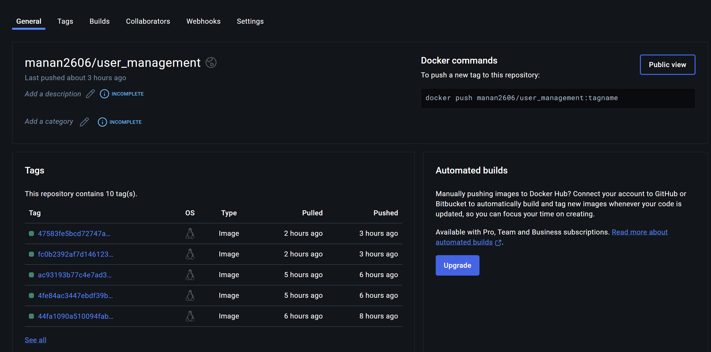

# User Management System  

## Overview  
User Management System is a Python-based FastAPI application designed to manage user accounts, roles, authentication, and profile information. It integrates PostgreSQL for data storage and leverages JWT tokens for secure user authentication. This project also includes extensive automated testing with Pytest, achieving high code coverage.  

## Features  

### 👤 User Profile Management  
- **Description:** Allows users to update their profile fields and enables managers or admins to upgrade users to professional status.  
- **User Story:**  
  - As a user, I want to manage my profile information and be upgraded to professional status by managers or admins.  
- **Minimum Viable Feature:**  
  - Implemented API endpoints for updating user profile fields (e.g., name, bio, location).  
  - Created separate API endpoints for managers and admins to upgrade users to professional status.  
  - Updated the user profile page to display professional status and allow field edits.  
  - Added notifications for users upon professional status upgrades.  
- **Optional Enhancements:**  
  - Profile field validation to ensure data integrity.  
  - Dynamic addition of profile fields by users.  
  - User-friendly interface for managers and admins to search and select users for professional status upgrades.  

### 🔒 Authentication and Authorization  
- JWT-based authentication for secure user login.  
- Role-based access control for different user roles (`ADMIN`, `MANAGER`, `AUTHENTICATED`, `ANONYMOUS`).  

### 📧 Email Verification  
- Users must verify their email to complete registration.  
- Email validation logic refined to handle edge cases and errors.  

### 📝 Enhanced Password Validation  
- Strong password validation ensuring:  
  - At least 8 characters.  
  - At least one digit, one uppercase letter, and one special character.  
- Applied during user creation, updates, and password resets.  

### 🔗 HATEOAS Links for API Discoverability  
- Dynamic navigation links provided in API responses to improve client usability.  

### 🛠️ Extensive Testing  
- Added over 25 test cases, including the following:  
  - User profile management functionality.  
  - Professional status upgrade features.  
  - Email validation and password validation.  
  - Role-based access control and edge cases.  
- Achieved high test coverage with `pytest` and `pytest-cov`.  

## Docker Repository  
The application is containerized for easy deployment. The Docker image for this project is available on Docker Hub:  
[Docker Hub Repository - User Management System](https://hub.docker.com/repository/docker/manan2606/user_management/general)  

## Issues Solved  

### 1. [Email Validation Error](https://github.com/Manan2606/user_management/issues/1)  
- **Problem:** Anonymous users failed to receive email verification links due to invalid UUID errors.  
- **Solution:** Refined email verification logic to prevent UUID-related validation errors.  

### 2. [`is_professional` Does Not Modify](https://github.com/Manan2606/user_management/issues/3)  
- **Problem:** Changes to the `is_professional` field were not being saved.  
- **Solution:** Updated the `UserService.update` method to properly save changes to `is_professional`.  

### 3. [Default User Role Override](https://github.com/Manan2606/user_management/issues/6)  
- **Problem:** Registered users were incorrectly defaulted to the `ANONYMOUS` role.  
- **Solution:** Adjusted the `UserService.create` logic to respect the input role during registration.  

### 4. [Infinite Loop in Nickname Generation](https://github.com/Manan2606/user_management/issues/8)  
- **Problem:** Potential for infinite loops during nickname generation.  
- **Solution:** Implemented a maximum retry mechanism to break the loop if nickname conflicts persist.  

### 5. [Enhanced Password Validation](https://github.com/Manan2606/user_management/issues/10)  
- **Problem:** Password strength rules were insufficient during user creation and reset.  
- **Solution:** Added robust password strength validation to enforce secure passwords for all users.  

## Outcomes  
This project provided valuable insights into designing secure, scalable, and user-centric APIs. Key learnings include:  
- Mastery of FastAPI for building RESTful services with authentication and role-based access control.  
- Implementation of HATEOAS principles for API discoverability.  
- Strengthened testing practices with `pytest` and improved code coverage.  
- Effective handling of real-world challenges like email verification, user role management, and password security.  

Through this project, I successfully implemented a comprehensive user management system while addressing critical issues and incorporating user feedback. The result is a robust, secure, and user-friendly application.  

